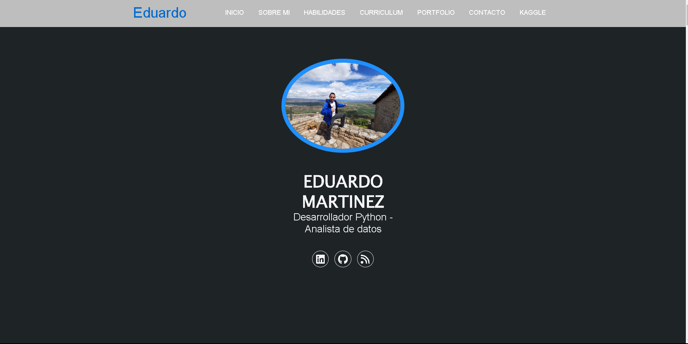
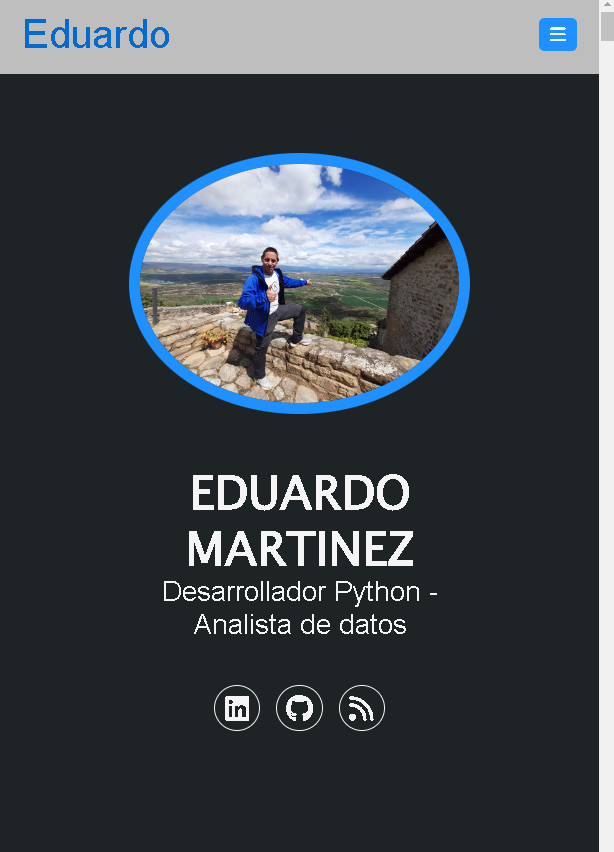

# Este es el resultado de la creación de mi primer portfolio web usando HTML, CSS y JavaScript.
# En sucesivas entregas, iré implementando funcionalidades extra.

# Espero que seáis comprensibles conmigo si véis muchos errores, ya que llevo poco tiempo en este mundo tecnológico, pero estoy seguro que con vuestras aportaciones y mis ganas de mejorar continuamente, lograré corregirlos y cometer menos errores ( o al menos otros distintos) en el futuro.

# TODOS los consejos, sugerencias, anotaciones, indicaciones, críticas (siempre que sean CONSTRUCTIVAS), comentarios, etc son y serán BIENVENIDOS.

<a href="mailto:loquelojonove1975@gmail.com" target="_blank" title="Email" rel="noopener"></i></a>
